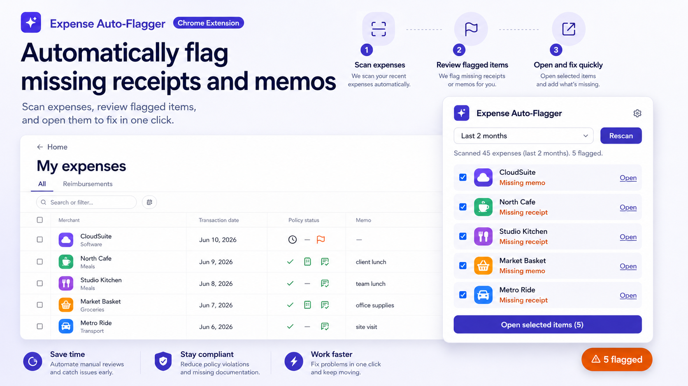

# Ramp Flagger

A Chrome extension for [Ramp](https://ramp.com)'s "My expenses" page that finds which of
your recent expenses are missing a memo or a receipt — even ones Ramp itself marks as
compliant — so you can catch and fix them before they become a problem.

It also lets you fill in a missing memo directly from its panel, without opening or even
scrolling to the row.

## Install

This isn't published on the Chrome Web Store — install it as an unpacked extension:

1. Download or clone this repository.
2. Open `chrome://extensions` in Chrome.
3. Turn on **Developer mode** (top-right toggle).
4. Click **Load unpacked** and select this folder.
5. Open `https://app.ramp.com/home/personal-expenses/all`. A **Missing memo/receipt** button
   appears in the bottom-right corner of the page.

No build step, no dependencies to install — it's plain JS/CSS/HTML, loaded exactly as it is
in this repo.

## How to use it

**1. Scan.** Click the floating button. The first click automatically scans your trailing 2
months of expenses — no extra setup needed.

**2. Review the results.** The panel shows how many expenses were scanned and how many were
flagged. Each flagged expense lists its merchant, date, amount, and whether it's missing a
memo, a receipt, or both.

**3. Fix a missing memo right there.** Every memo-flagged expense has its own text box in the
panel. Type the memo and click **Save** (or press Enter) — it's written straight into that
expense in Ramp. No need to open the expense, scroll to it, or leave the page you're on.

**4. Handle a missing receipt.** Receipts can't be filled in from the panel (they need an
actual file to upload), so instead: check the boxes next to the expenses you want to handle
(all are checked by default) and click **Open N selected in new tabs** — each one opens
directly to its Ramp page, ready for you to attach a receipt.

**5. Change the date range.** Use the dropdown in the panel (last 1, 2, or 3 months, or
everything) and click **Rescan**.

**6. If there's more than 50 expenses in range:** Ramp only loads 50 rows at a time, and its
own "next page" control needs a real click from you (see [Limitations](#limitations)). When
this happens, the panel will ask you to click Ramp's pagination arrow yourself, then click
**Continue scan** to keep going from there.

**7. Check from anywhere.** Click the extension's icon in your Chrome toolbar to see the same
flagged list without needing the Ramp tab open or focused. The badge on the icon shows the
flagged count from your last scan (or a gray `!` if the last scan hit an error, so you know
not to trust a stale count).

## How it decides something is "missing"

- **Memo** — the Memo column is empty, or has only whitespace or a dash placeholder in it.
  Any real text counts as present, including a memo Ramp filled in automatically (e.g. for a
  recurring subscription).
- **Receipt** — none of these are present: a checkmark-style receipt icon (manually uploaded
  or verified), an auto-generated-receipt icon (common for SaaS subscription charges Ramp
  can generate a receipt for on its own), or a "View receipt" link. All three are checked
  independently of the Policy status column, since that column reflects whether a receipt is
  policy-*required*, not whether one actually exists.

## Limitations

- **Crossing a 50-row page boundary needs one manual click** on Ramp's own pagination
  control — it doesn't respond to automated clicks, and getting around that would need a much
  heavier browser permission than seems worth it for saving one click every 50 rows.
- **Only the combined "All" expenses tab is supported**, not Ramp's separate
  "Reimbursements" tab — that view lays its columns out differently and isn't handled yet.
- **Reads Ramp's page directly**, since there's no official API for this data. It's built to
  tolerate minor layout changes, but a significant Ramp redesign could still break it — if
  that happens, you'll see an inline error rather than a silently wrong result.
- **If you have multiple Ramp expense tabs open at once**, the toolbar popup's actions act on
  whichever tab Chrome considers current, not necessarily the one you mean.
- **Each scan reflects exactly what's on the page right now** — there's no memory of
  previously-dismissed items, and no automatic/background scanning.
- The inline memo text box only appears in the on-page panel, not in the toolbar popup (the
  popup shows the same flagged list, but writing a memo there isn't supported yet).

## Permissions & privacy

- **Storage** — to remember your last scan's results, so the toolbar popup can show them
  without re-scanning.
- **Access to `app.ramp.com`'s expenses page only** — not all of Ramp, and no other site.
- **No `tabs` or `scripting` permission.** Nothing is ever injected into another tab, and
  opening/reading tabs for the features that need it (the toolbar popup, "open selected")
  doesn't require that broader permission.
- **No network requests, ever.** Everything happens by reading the page you already have
  open — this extension never sends your data anywhere.

The only thing this tool ever writes is a memo you typed yourself, into the same expense's
memo field you'd otherwise type it into by hand. It never touches any other field, and it
never touches receipts (those need an actual file, so they always go through Ramp's own page,
which you interact with directly).

## License

Apache License 2.0 — see [LICENSE](LICENSE).

## Contributing

See `CLAUDE.md` for the internals: file layout, the DOM signals this tool relies on and why,
and how to verify a change actually works against a live Ramp account.
